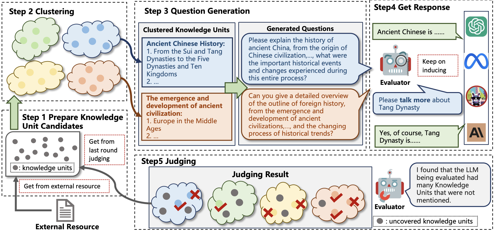

# RECKON - Reference-based Efficient Knowledge Evaluation Framework

[](LICENSE)  [](https://arxiv.org/abs/2504.00756)

## Overview

RECKON (Reference-based Efficient Knowledge Evaluation) is a framework for assessing knowledge capabilities of large language models using dynamic reference data. The system dynamically organizes unstructured reference data into manageable knowledge units and generates targeted evaluation questions through semantic clustering.

**Key Paper**: [RECKON: Large-scale Reference-based Efficient Knowledge Evaluation for Large Language Model](https://arxiv.org/pdf/2504.00756)




## Features

- 📚 Knowledge Unit Extraction: Extract structured knowledge units from raw text
- 🧩 Semantic Clustering: Organize knowledge units through embedding-based clustering
- ❓ Adaptive Question Generation: Automatically generate domain-specific questions
- 🧪 Comprehensive Evaluation: Multi-dimensional assessment of model knowledge coverage

## Quick Start

### Requirements

- Python 3.8+
- Required dependencies:
  ```bash
  pip install openai tqdm scikit-learn umap-learn nltk
  ```

### Workflow

1. **Knowledge Extraction**:
   ```bash
   python get_kp.py --input data/text/test_data.txt --output data/kps/test_data.jsonl --domain legal
   ```

2. **Embedding Generation**:
   ```bash
   python get_embedding.py --input data/kps/test_data.jsonl --output data/embeddings/legal_emb.jsonl
   ```

3. **Knowledge Clustering**:
   ```bash
   python process.py cluster --emb_file data/embeddings/legal_emb.jsonl --ku_file data/kps/test_data.jsonl
   ```

4. **Question Generation**:
   ```bash
   python process.py question --domain legal --model gpt4
   ```

5. **Evaluation Execution**:
   ```bash
   python process.py evaluate --round 3
   ```

### Output Example

Evaluation results include:
```json
{
  "cluster_id": 12,
  "coverage": 0.85,
  "accuracy": 0.92,
  "problematic_units": ["Criminal Law Amendments", "Civil Code Inheritance Clauses"]
}
```

## Configuration Parameters

| Parameter | Description | Default |
|-----------|-------------|---------|
| --domain  | Evaluation domain (legal/medical/code) | Required |
| --model   | GPT model version | gpt4 |
| --round   | Evaluation iterations | 3 |

## Citation

If you use RECKON in your research, please cite our paper:
```bibtex
@misc{zhang2025reckonlargescalereferencebasedefficient,
      title={RECKON: Large-scale Reference-based Efficient Knowledge Evaluation for Large Language Model}, 
      author={Lin Zhang and Zhouhong Gu and Xiaoran Shi and Hongwei Feng and Yanghua Xiao},
      year={2025},
      eprint={2504.00756},
      archivePrefix={arXiv},
      primaryClass={cs.CL},
      url={https://arxiv.org/abs/2504.00756}, 
}
```

## License

This project is licensed under the [MIT License](LICENSE).
